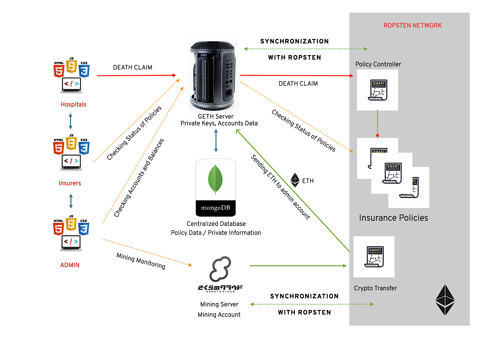

## Death Claim Prototype System

## Specs
### Backend
* Geth Version: 1.8.12-stable-37685930
* Solidity Remix with Solidity Version: 0.4.24

### Frontend
* Node JS Version: 9.4.0
* Meteor Framework Version: 1.7.0.3

### Network
* Ropsten Ethereum Test Network

## Functions
### Dashboard
  * Accounts Management
  * Blocks Information
  * Transaction Information

### Insurers Page
* Policies Management
  * Policies List with Check Buttons
  * Showing status of each policies

### Hospitals Page
* Claim Triggers
  * Policies List with "Death Claim" buttons
    * Triggering the claim of each policies
    * Note: Authority Check logic is not available in this prototype phase and will be updated in the next phases.

## System Summary

